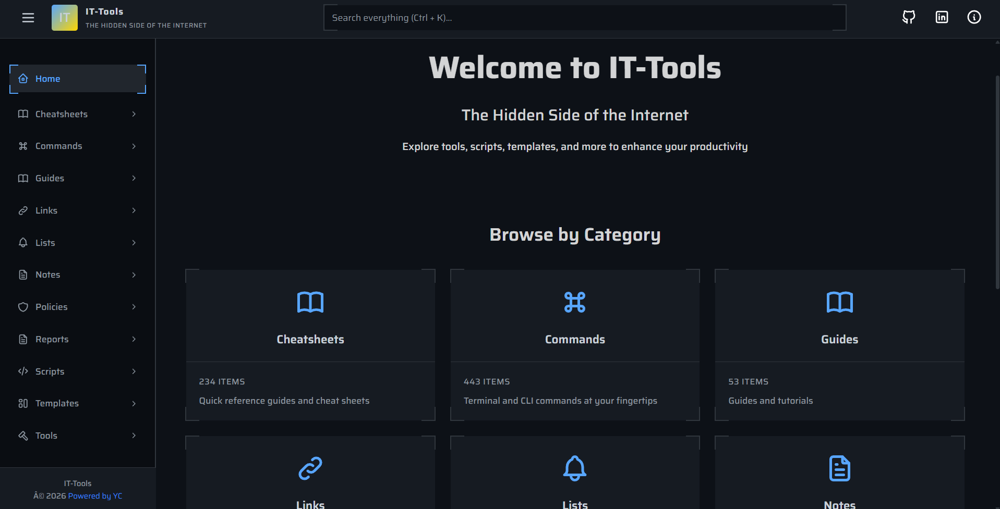

<h1 align="center">IT-Tools</h1>



IT-Tools is a practical cybersecurity and systems knowledge platform focused on useful execution, not noise.
It combines browser-based tools with structured content so learners and practitioners can move faster across real technical workflows.

## What IT-Tools Includes

- Browser tools for parsing, conversion, generation, analysis, and validation
- Curated guides, notes, commands, cheatsheets, and lists
- Reusable templates, policies, and reports for delivery and documentation
- Link collections with categorized resources
- A unified content scaffolding system for adding new sections quickly

Current content areas in this repo:

- `tools`
- `guides`
- `commands`
- `cheatsheets`
- `scripts`
- `notes`
- `templates`
- `policies`
- `reports`
- `lists`
- `links`

## Tech Stack

- Vue 3 + Vite
- TypeScript
- Pinia
- Naive UI
- UnoCSS
- Vitest + Playwright
- PNPM workstream and custom content generation scripts

## Getting Started

### Prerequisites

- Node.js 18+ (LTS recommended)
- PNPM 9+

### Install

```bash
pnpm install
```

### Run Dev Server

```bash
pnpm dev
```

### Typecheck, Lint, and Test

```bash
pnpm typecheck
pnpm lint
pnpm test:unit
pnpm test:e2e
```

### Build for Production

On macOS/Linux:

```bash
pnpm build
```

On Windows PowerShell (if inline `NODE_OPTIONS=...` fails in shell):

```powershell
$env:NODE_OPTIONS="--max_old_space_size=4096"
pnpm exec vue-tsc --noEmit
pnpm exec vite build
```

### Preview Production Build

```bash
pnpm preview
```

## Content Creation Workflow

IT-Tools uses script-driven scaffolding to keep structure and metadata consistent.

### 1. Create a new content type (optional)

```bash
pnpm create:content "<type>"
```

Example:

```bash
pnpm create:content "playbooks"
```

### 2. Create an item inside a content type

```bash
pnpm create:items <content-type> "<item-name>" --subcategory "<subcategory>"
```

Examples:

```bash
pnpm create:items guides "linux-user-management" --subcategory "How-To Guides"
pnpm create:items notes "incident-response-timeline" --subcategory "SOC Notes"
pnpm create:items links "threat-intel-sources" --subcategory "Threat Intelligence"
```

### 3. Create script items in specific script formats

```bash
pnpm create:items scripts "backup-rotation" bash
pnpm create:items scripts "daily-health-check" bash,batch,python
pnpm create:items scripts "ops-bundle" all
```

Supported script formats:

- `bash`
- `batch`
- `python`
- `powershell`
- `yaml`
- `zsh`
- `fish`
- `tcl`

### 4. Delete items or content types

```bash
pnpm delete:items <content-type> "<item-name>"
pnpm delete:content <content-type>
```

### 5. Sync category files after major edits

```bash
pnpm sync:categories
```

## Project Structure

```text
.
|-- src/
|   |-- content/              # All generated and curated content
|   |   |-- tools/
|   |   |-- guides/
|   |   |-- commands/
|   |   |-- cheatsheets/
|   |   |-- scripts/
|   |   |-- notes/
|   |   |-- templates/
|   |   |-- policies/
|   |   |-- reports/
|   |   |-- lists/
|   |   `-- links/
|   |-- pages/                # App pages (Home, About, etc.)
|   |-- layouts/              # App layouts
|   |-- components/           # Shared UI components
|   |-- stores/               # Pinia state stores
|   `-- ui/                   # UI styling and behavior assets
|-- scripts/                  # Scaffolding and maintenance scripts
|   |-- templates/            # Generation templates
|   `-- lib/                  # Shared script utilities
|-- Readme/                   # Extended internal docs
|-- Dockerfile
|-- nginx.conf
`-- vercel.json
```

## Deployment

### Docker

```bash
docker build -t it-tools .
docker run -p 8080:80 it-tools
```

### Vercel

This repo includes SPA rewrite routing in `vercel.json`:

- Route fallback to `/index.html` for client-side routes

## Scripts Reference

Main project scripts from `package.json`:

- `pnpm dev`
- `pnpm build`
- `pnpm preview`
- `pnpm typecheck`
- `pnpm lint`
- `pnpm test:unit`
- `pnpm test:e2e`
- `pnpm create:content`
- `pnpm create:items`
- `pnpm delete:content`
- `pnpm delete:items`
- `pnpm sync:categories`
- `pnpm release`

## Contribution Guidelines

1. Keep naming in kebab-case for new content items.
2. Assign each item to an intentional subcategory.
3. Run `pnpm sync:categories` after bulk creation/deletion.
4. Run `pnpm typecheck` and `pnpm lint` before opening a PR.
5. Prefer practical, field-usable content over generic theory.

## Usage and Responsibility

This platform includes security and investigation-oriented material.
Use all techniques and tools only in authorized, legal, and ethical contexts.

## Attribution & Credits

Portions of content, structure, or inspiration in this project are derived from publicly available resources, including:

- https://it-tools.tech/
- https://sharevb-it-tools.vercel.app/
- https://github.com/r1cksec/cheatsheets/
- https://github.com/trimstray/the-book-of-secret-knowledge

All trademarks, content, and intellectual property remain the property of their respective owners.  
This project is intended for educational and informational purposes only.

## License

GNU GPLv3